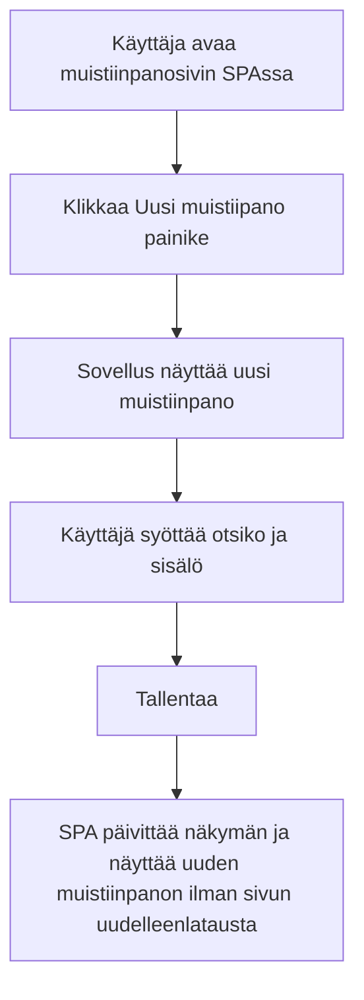

# 0.6: Uusi muistiinpano

```mermaid
flowchart TD
    A[Käyttäja avaa muistiinpanosivin SPAssa] --> B[Klikkaa Uusi muistiipano painike];
    B --> C[Sovellus näyttää uusi muistiinpano];
    C --> D[Käyttäjä syöttää otsiko ja sisälö];
    D --> E[Tallentaa];
    E --> F[SPA päivittää näkymän ja näyttää uuden muistiinpanon ilman sivun uudelleenlatausta];
```